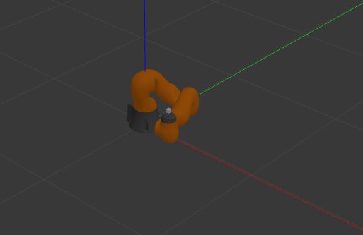

# UR5 Robot Manipulator Trajectory Planner

Questo repository contiene un progetto completo per il controllo di un robot manipolatore, costituito da 6 giunti rotoidali, tramite pianificazione di traiettorie cartesiane multi-target, con profilo di velocità cubico e orientazione vincolata dell'end-effector.

---

## 1. Informazioni Generali

### Ambiente Docker

* **Base image:** `Ubuntu 20.04.6 LTS`
* **ROS Version:** ROS Noetic Desktop full
* **Librerie esterne:**

  * `orocos_kdl`
  * `kdl_parser`
  * `Eigen3`
  * `roscpp`, `rospy`
  * `sensor_msgs`, `geometry_msgs`
* **Tooling:** `catkin_make`


## 2. Configurazione Iniziale del Robot

### Configurazione di partenza dei giunti

Il robot si avvia in una configurazione sicura e non singolare:

```
J0 = 0.0
J1 = +1.57
J2 = -1.57
J3 = -1.20
J4 = +1.57
J5 = -1.57
J6 = -0.37
```

---

## 3. Punti Target

Tutti i target mantengono **identica orientazione**, vincolata all’orientazione iniziale dell’end-effector.

| Target | Offset (X, Y, Z)     | Descrizione                  |
| ------ | -------------------- | ---------------------------- |
| T1     | (+0.10, 0.00, 0.00)  | Movimento in avanti          |
| T2     | (0.00, -0.70, 0.00)  | Movimento laterale sinistro  |
| T3     | (0.00, 0.00, +0.30)  | Sollevamento verticale       |
| T4     | (-0.70, +0.20, 0.00) | Movimento diagonale indietro |

---

## 4. Pianificazione e Profilo di Velocità

### Profilo di velocità utilizzato

✔ Cubic velocity profile (polinomiale cubico)

### Tipo di pianificazione

✔ Pianificazione cartesiana multi-segmento
✔ Calcolo della traiettoria tramite:

```
compute_multi_traj_cubic_prof_frames()
```

Ogni segmento viene pianificato tra due target consecutivi.

### Comportamento multi-target

L’indice dei target avanza ciclicamente:

```
T1 → T2 → T3 → T4 → T1 → ...
```

---

## 5. Controllo del Robot

### Controllo cartesiano

Il controllo invia:

* `des_pose` (posizione + orientazione)
* `des_cart_vel` (velocità cartesiana)
* `des_cart_acc` (accelerazione cartesiana)

## 6. Come avviare il sistema

### 1. Clonare la repository

```bash
git clone <repo-url>
cd <repo>
```

### 2. Build del workspace

```bash
catkin_make
source devel/setup.bash
```

### 3. Inizializzare Gazebo

```bash
roslaunch iiwa_gazebo iiwa_gazebo_effort.launch
```

### 4. Avviare il nodo di pianificazione di traiettoria

```bash
rosrun kdl_ros_control kdl_robot_test ./src/iiwa_stack/iiwa_description/urdf/iiwa14.urdf
```

### 5. Avviare gazebo

Startare semplicemente la simulazione su gazebo


